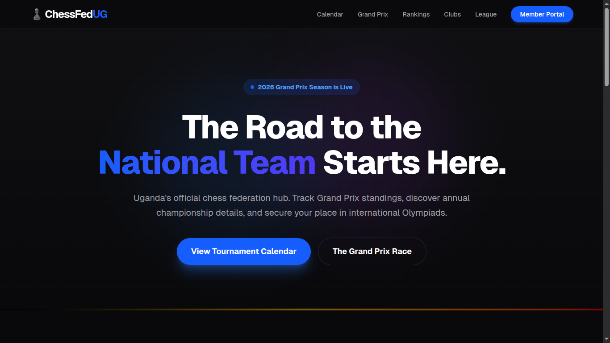
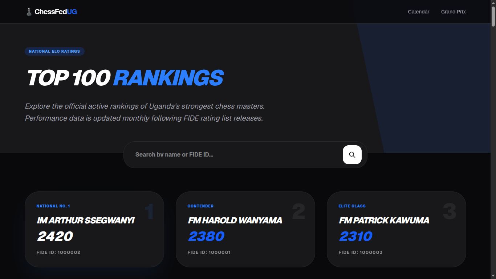
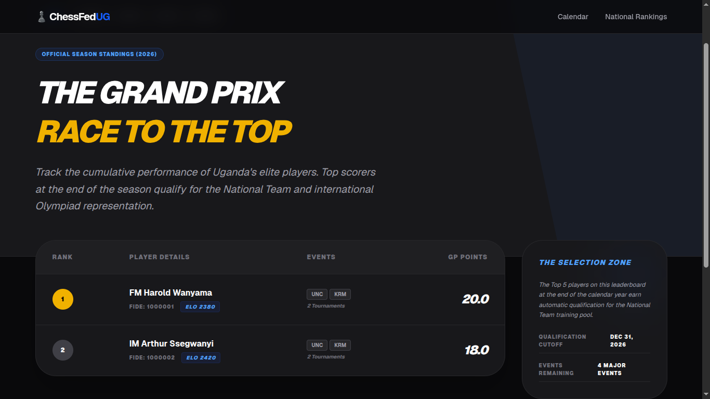
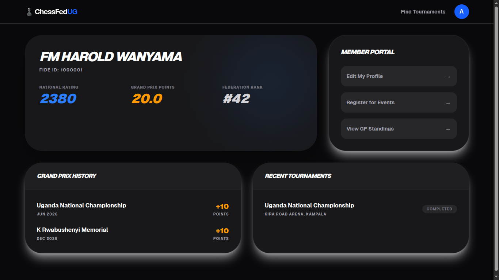

# ♟️ ChessFed Uganda (ChessHub UG)

**Empowering Ugandan Chess Excellence through a Professional Digital Ecosystem.**

ChessFed Uganda is the official high-fidelity digital hub designed for the Uganda Chess Federation. It serves as a comprehensive platform for tournament discovery, national rankings, Grand Prix tracking, and professional federation operations.


---

## 📸 Preview

| Landing Page | National Rankings |
| :--- | :--- |
|  |  |

| Grand Prix Standings | Member Dashboard |
| :--- | :--- |
|  |  |

---

## 🇺🇬 Proudly Ugandan & Elegant by Design
The platform features a modern, eye-soothing dark aesthetic (`Zinc-950`) that harmonizes the **Official Federation Blue** with the vibrant **National Flag Colors** (Black, Yellow, Red). Every view is optimized for spatial efficiency and visual prestige.

---

## 🚀 Key Features

### 1. Public Awareness Hub
*   **Dynamic Tournament Calendar:** Browse the official 2026 season with real-time status indicators.
*   **Event Portals:** Dedicated high-impact pages for major championships featuring prize funds, history, and partner spotlights.
*   **Grand Prix Engine:** A real-time cumulative leaderboard tracking the race for the National Team.
*   **National Rankings:** Official Top 100 ELO rankings updated monthly from FIDE records.
*   **Clubs & League Directory:** Comprehensive roster and standings for 20+ official Ugandan chess clubs.

### 2. Member Experience
*   **Verified Identity Linking:** Securely link physical FIDE/National IDs to digital accounts.
*   **Player Dashboard:** Personal performance hub showing ELO history and upcoming registered events.
*   **Professional Onboarding:** Modern, validated Sign-In and Registration flows powered by `React Hook Form` and `Zod`.
*   **Tournament Entry:** Streamlined registration flow with deadline validation and fee transparency.

### 3. Federation Operations (Admin)
*   **Oversight Console:** Central command for federation officials to track participation and growth.
*   **Event Management:** Tools to initialize tournaments and broadcast Grand Prix points directly to the public standings.
*   **Club Management:** Captain-level access to manage 12-man team rosters and lock league line-ups.

---

## 🛠️ Tech Stack

*   **Framework:** Next.js 15 (App Router)
*   **Language:** TypeScript
*   **Styling:** Tailwind CSS v4 (Modern High-Fidelity)
*   **ORM:** Prisma (PostgreSQL support)
*   **Authentication:** NextAuth.js
*   **Forms:** React Hook Form + Resolver Zod
*   **Database Simulation:** High-fidelity mock store for functional "Demo Mode" without a live DB.

---

## 📦 Getting Started

### Prerequisites
*   Node.js 18.x or later
*   npm / bun / yarn

### Installation

1. **Clone the repository:**
   ```bash
   git clone https://github.com/AskTiba/ChessFed-Ug.git
   cd ChessFed-Ug
   ```

2. **Install dependencies:**
   ```bash
   npm install
   ```

3. **Generate Prisma Client:**
   ```bash
   npx prisma generate
   ```

4. **Run the development server:**
   ```bash
   npm run dev
   ```

Open [http://localhost:3000](http://localhost:3000) to see the platform in action.

---

## 🗺️ Navigation & Access
The MVP is fully browsable. Some specific routes for testing:
*   **Main Hub:** `/`
*   **Leaderboards:** `/grand-prix` | `/rankings`
*   **Admin Access:** `/admin` (Simulation Mode)
*   **Member Portal:** `/dashboard` (Login as `anthony@example.com`)

---

## 📝 Status & Roadmap
*   [x] **Phase 1:** Public Awareness Hub (Calendar, Rankings, Portals)
*   [x] **Phase 2:** Functional Simulation MVP (Server Actions, Mock Store)
*   [x] **Phase 3:** High-Fidelity UI/UX Polish (National Pride Theme)
*   [ ] **Phase 4:** Live Production Backend (PostgreSQL & Socket.io Live Games)

---

## 🤝 Contributing

We ❤️ Open Source! This project is an open-source initiative dedicated to improving the digital infrastructure of Ugandan chess. We warmly welcome contributions from the community.

### How to Contribute:
1.  **Fork** the repository.
2.  **Create a feature branch** (`git checkout -b feature/AmazingFeature`).
3.  **Commit your changes** (`git commit -m 'Add some AmazingFeature'`).
4.  **Push to the branch** (`git push origin feature/AmazingFeature`).
5.  **Open a Pull Request**.

---

## 📜 License & Credit
This project is currently the official digital development effort for the **Uganda Chess Federation Community**. 

Built with passion by **Anthony Tibamwenda**.

© 2026 Uganda Chess Federation. All Rights Reserved.
