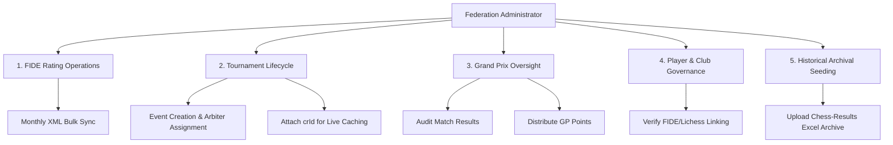

# ♟️ Federation Administrator Roles & Workflow Specification

**Document Version:** 1.0  
**Target Audience:** Uganda Chess Federation (UCF) Executive Committee, Chief Arbiters, & System Administrators  
**Platform:** ChessHub Uganda (`chesshub-ug`)  

---

## 1. Executive Summary
The Admin Console in ChessHub Uganda serves as the central command center for all Federation operations. It provides role-based access control (RBAC) to ensure that arbiters, organizers, and executive officials can securely manage player rankings, tournament lifecycles, financial reporting, and historical data integrity.

This specification outlines the exact responsibilities, workflows, and technical mechanisms governing Federation Administrators.

---

## 2. Core Administrator Responsibilities

### 1. FIDE Rating Operations (Monthly Sync Engine)
**Role:** Ratings Officer / System Administrator  
**Frequency:** Monthly (1st of every month)  
- **Objective:** Maintain a canonical, self-hosted mirror of FIDE standard, rapid, and blitz ratings for all active and inactive Ugandan players.
- **Workflow:**
  1. Admin navigates to `app/admin` $\rightarrow$ **FIDE Data Sync Panel**.
  2. Clicks **"PULL LATEST FIDE RATINGS"**.
  3. The system downloads the official XML compressed archive from `ratings.fide.com`, filters for `country="UGA"`, and executes a bulk upsert into the `FidePlayer` table.
  4. Generates an automated audit log in `FideSyncLog` detailing total records synced and error states.

### 2. Tournament Lifecycle Management
**Role:** Tournament Organizer / Chief Arbiter  
**Frequency:** Per Event  
- **Objective:** Schedule official Federation events, configure registration fees, assign arbiters, and establish live pairing feeds.
- **Workflow:**
  1. Admin navigates to `app/admin/tournaments/new`.
  2. Enters core metadata: Title, Dates, Venue, Format (Swiss/Round-Robin), Registration Fee, Prize Fund, and Grand Prix status.
  3. **Option B Live Caching Link:** Once the tournament is created on Chess-Results by the Chief Arbiter, the Admin pastes the **Chess-Results ID (`crId`)** into the tournament portal.
  4. The platform automatically initializes the `TournamentLiveData` caching engine, pulling live pairings and standings every 5 minutes during active play.

### 3. Grand Prix (GP) Oversight & Point Distribution
**Role:** Federation Executive / Chief Arbiter  
**Frequency:** Post-Tournament Concurrency  
- **Objective:** Calculate and allocate official national Grand Prix points that determine National Team selection for Olympiads and All-Africa Games.
- **Workflow:**
  1. Upon tournament conclusion (`endDate` passed), Admin navigates to `app/admin/grand-prix/audit`.
  2. Clicks **"RUN AUDIT ENGINE"** to verify that all round results match the Chief Arbiter's signed PGN/Excel sheets.
  3. Admin navigates to `app/admin/grand-prix/distribute?id=[tournamentId]`.
  4. The system calculates GP points based on final standings and tournament multiplier tier (e.g., National Championship = 2.0x, Regional Open = 1.0x) and inserts records into `GrandPrixPoint`.

### 4. Player Verification & Club Governance
**Role:** Secretary General / League Commissioner  
**Frequency:** Ongoing / Seasonal  
- **Objective:** Ensure all registered users are verified Federation members, approve club captaincies, and lock league team rosters.
- **Workflow:**
  - **Player Verification:** Admin reviews pending user registrations, verifying FIDE IDs against national identity documents before granting `PLAYER` or `OFFICIAL` roles.
  - **League Roster Lock:** Prior to the National League kickoff, the League Commissioner locks club rosters to prevent mid-season unauthorized player transfers.

### 5. Historical Archival Seeding (Option A Engine)
**Role:** System Administrator / Archivist  
**Frequency:** Periodic / Archival Backlog  
- **Objective:** Populate the platform with Uganda's complete 12-year chess history (2014–Date) without executing slow, rate-limited scraping requests.
- **Workflow:**
  1. Admin downloads the official bulk Excel/CSV export from Chess-Results `TurnierSuche.aspx`.
  2. Navigates to `app/admin` $\rightarrow$ **Chess-Results Bulk Archive Panel**.
  3. Pastes the raw text rows or uploads the `.xls`/`.csv` file.
  4. The seeding engine instantly parses the records, populates the Postgres `Tournament` table, and attaches canonical `crId`s for permanent Option A Lichess/Chess-Results historical lookups.

---

## 3. Administrator Role-Based Access Control (RBAC) Matrix

| Feature / Module | `ADMIN` (Superuser) | `OFFICIAL` (Arbiter/Org) | `PLAYER` (Member) |
| :--- | :---: | :---: | :---: |
| **FIDE Monthly Bulk Sync** | ✅ | ❌ | ❌ |
| **Create / Edit Tournaments**| ✅ | ✅ | ❌ |
| **Attach crId / Live Feed** | ✅ | ✅ | ❌ |
| **Distribute GP Points** | ✅ | ✅ (Chief Arbiter Only)| ❌ |
| **Verify Player FIDE Links** | ✅ | ✅ | ❌ |
| **Upload Archive Excel/CSV** | ✅ | ❌ | ❌ |
| **View Admin Dashboard** | ✅ | ✅ | ❌ |

---

## 4. Security & Audit Logging Protocol
To maintain absolute integrity in national sports governance:
- All sensitive actions (GP distribution, FIDE syncs, Arbiter assignments) require re-authentication and are logged with the Administrator's `userId`, IP address, and timestamp.
- Database deletions are strictly soft-deleted or cascaded through secure Prisma transactions to prevent orphaned pairing records.

> [!TIP]
> Arbiters operating in areas with low internet connectivity can rely on the **Raw Text Paste** feature in the Archive Seeding panel to upload tournament results instantly via SMS or copied text strings!
