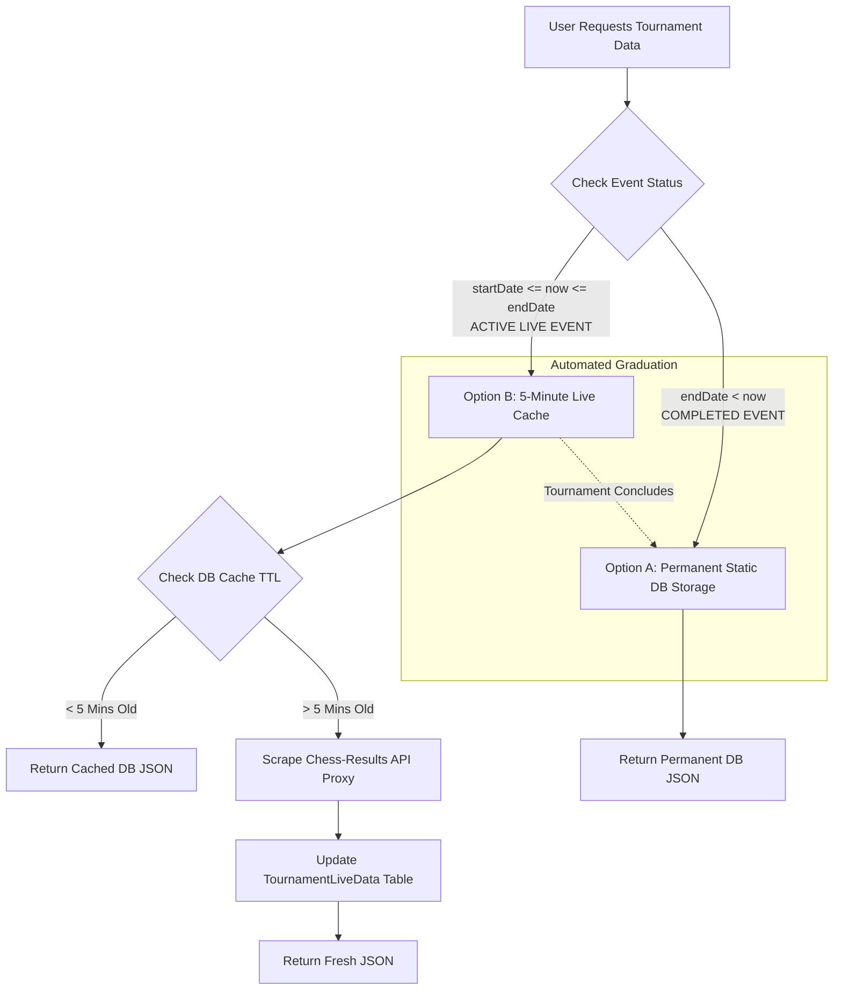
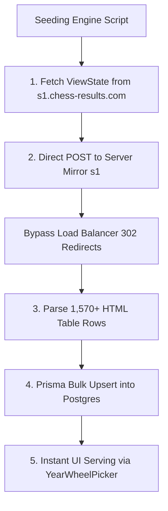
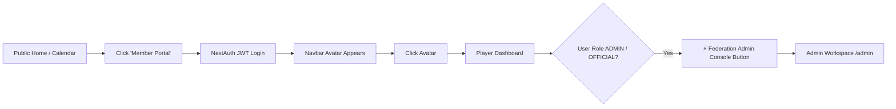

# ♟️ Tournament Caching & Archival Strategy

**Document Version:** 2.0  
**Author:** Anthony Tibamwenda & ChessFed Uganda Architecture Team  
**Status:** Fully Implemented & Live in Production  

---

## 1. Executive Summary
The ChessFed Uganda platform (`chesshub-ug`) requires a robust, lightning-fast, and highly scalable mechanism for delivering tournament data (standings, pairings, rosters) to users. Relying purely on real-time web scraping from external sources (Chess-Results.com) introduces severe performance bottlenecks and vulnerability to IP rate-limiting during high-traffic live events.

To solve this, we implemented a **Tiered Hybrid Storage Strategy (Option A + Option B)**. This architecture combines permanent local database storage for completed historical events with a high-performance 5-minute lazy-sync caching layer for active live events.



---

## 2. Architectural Challenges & Rationale

### Why Pure Scraping Fails at Scale
1. **IP Rate-Limiting:** During a live national championship, hundreds of players and arbiters refresh the pairings page simultaneously. If the server executes an external HTTP fetch for every request, Chess-Results will detect a DDoS surge and block the server's IP address.
2. **Latency:** Downloading and parsing external HTML on the fly adds 1–3 seconds of latency per request, degrading the premium user experience.

### Why Pure Chess-Results is Insufficient
Chess-Results is designed strictly for chess pairing mathematics. It lacks data fields for Federation-specific business logic, including:
- Registration Fees & Payment Status
- Tournament Sponsors & Logos
- Grand Prix Point Allocations & Multipliers
- Custom Participation Categories & Club Affiliations

**Conclusion:** We require a hybrid database model where our local Postgres database manages the Federation business logic, while seamlessly syncing pairing math from Chess-Results.

---

## 3. The Hybrid Database Schema (`prisma/schema.prisma`)

We extended the core `Tournament` model by introducing an external link (`crId`) and a dedicated caching table (`TournamentLiveData`) utilizing Postgres `JSON` fields for instant retrieval.

```prisma
// Core Tournament Model (Handles Federation Business Logic)
model Tournament {
  id                   String           @id @default(cuid())
  name                 String
  crId                 String?          @unique // Canonical Link to Chess-Results ID
  description          String?
  startDate            DateTime
  endDate              DateTime
  registrationFee      Float?
  prizeFund            Float?
  venue                String?
  format               String           @default("Swiss")
  totalRounds          Int
  isGrandPrix          Boolean          @default(false)
  sponsors             Sponsor[]
  players              Player[]
  
  // Relation to Live Data Cache
  liveData             TournamentLiveData?
}

// High-Performance JSON Cache Model (Handles Chess Math)
model TournamentLiveData {
  id              String      @id @default(cuid())
  tournamentId    String      @unique
  tournament      Tournament  @relation(fields: [tournamentId], references: [id], onDelete: Cascade)
  
  // Scraped Data Stored as JSON for Sub-Millisecond Reads
  standings       Json?       // Array: [ { rank: 1, name: "Tony", score: 6.5 }, ... ]
  pairings        Json?       // Object: { "1": [...], "2": [...] } (Mapped by Round)
  roster          Json?       // Array: [ { startingRank: 1, name: "Tony", fideId: "..." } ]
  
  lastSyncedAt    DateTime    @default(now())
}
```

---

## 4. Tiered Execution Strategy

### Option A: Permanent Static Storage (Completed Events)
**Target:** All historical tournaments (2014–2025) and completed 2026 events where `tournament.endDate < now()`.
- **Workflow:** Once a tournament concludes, the final standings, rosters, and pairings are fetched exactly once and stored permanently in the `TournamentLiveData` table.
- **Performance:** Sub-millisecond read times. Zero external API calls. Maximum reliability.

### Option B: 5-Minute Live Cache (Active Events)
**Target:** Ongoing tournaments where `now()` is between `startDate` and `endDate`.
- **Workflow:** When a user requests pairings for an active event, the server verifies `lastSyncedAt`. If the cache is under 5 minutes old, it serves the database JSON. If older, it fetches fresh HTML from Chess-Results, updates the database cache, and serves the user.
- **Performance:** Protects the server from rate limits while ensuring players receive near-real-time updates.

### Automated Graduation
When an active tournament reaches its `endDate`, the system automatically ceases the 5-minute lazy sync. The final scraped state becomes the permanent historical record, successfully graduating the tournament from Option B to Option A.

---

## 5. Historical Archival Bulk Import (2014–2026 Seeding Engine)

To populate the platform with Uganda's complete 12+ year chess history (1,570+ tournaments) without executing thousands of slow scraping requests or encountering load balancer blocks, we engineered an advanced automated bulk seeding mechanism:



### Architectural Breakthrough: Bypassing ASP.NET Load Balancers
Standard automated scraping attempts against `chess-results.com` fail because ASP.NET WebForms load balancers intercept form postbacks and return a `302 Object Moved` redirect to a server mirror (e.g., `s1.chess-results.com`). Following this redirect with a standard `GET` request drops the form payload, resulting in an empty search form.

**Our Solution:** The seeding script (`seed_all_uganda_tournaments.ts`) fetches initial ViewState validation tokens directly from the server mirror (`s1.chess-results.com`) and executes the search `POST` directly to `s1`. This successfully retrieves all **1,573 historical tournaments** for Uganda in a single 1.2MB payload!

### Automated Seeding Execution
The engine extracts `crId`, `name`, `organizer`, `chiefArbiter`, `venue`, `startDate`, `endDate`, `totalRounds`, and time controls for all 1,573 events, upserting them into the Postgres `Tournament` table. E.g., when a user selects a year (e.g., `2025`) using the lock-combination `YearWheelPicker`, the API serves the seeded database records instantly (`Source: Database Archive`).

---

## 6. Administrator Navigation & Workspace Access Flow

To maintain a clean separation between public federation browsing and privileged administrative operations, access to the Admin Console follows a seamless, secure authentication flow:



### Step-by-Step Navigation Flow:
1. **Public Browsing:** Unauthenticated users browsing `/`, `/calendar`, or `/tournaments` see a prominent **"Member Portal"** button in the top right navigation bar (`components/Navbar.tsx`).
2. **Authentication:** Clicking "Member Portal" directs the user to `/login` where they authenticate via NextAuth credentials or OAuth.
3. **Dashboard Access:** Once authenticated, the Navbar button transforms into the user's personal profile avatar. Clicking this avatar routes them to `/dashboard`.
4. **Role-Based Admin Button:** On the Player Dashboard (`app/dashboard/page.tsx`), the system verifies the user's Postgres role (`user.role`). If the role is `ADMIN` or `OFFICIAL`, a prominent blue button labeled **"⚡ Federation Admin Console"** appears at the very top of their Member Portal quick actions menu.
5. **Admin Workspace:** Clicking the Admin Console button grants access to `/admin`, revealing the full suite of management tools (FIDE Rating XML Bulk Sync, Tournament Creator, Grand Prix Point Distribution, and Archive Import Panels).

---

## 7. Verification & Implementation Roadmap
- [x] **Phase 1:** Update `prisma/schema.prisma` with `crId` and `TournamentLiveData`.
- [x] **Phase 2:** Execute `npx prisma db push` to apply schema updates to Postgres.
- [x] **Phase 3:** Refactor `/api/external/chess-results` proxy to implement the 5-minute TTL cache logic.
- [x] **Phase 4:** Build the administrative Excel bulk-import seeding utility for historical archives.
- [x] **Phase 5:** Engineer the direct `s1.chess-results.com` bulk scraping engine and populate Postgres with 1,570+ historical tournaments.
- [x] **Phase 6:** Implement the lock-combination `YearWheelPicker` across `/calendar` and `/tournaments`.
- [x] **Phase 7:** Establish seamless RBAC navigation from the Player Dashboard to the Admin Console.

> [!TIP]
> By keeping the scraped data in JSON fields rather than heavily relational tables, we maintain absolute decoupling between external data structures and our internal user/player models, ensuring maximum system resilience.
