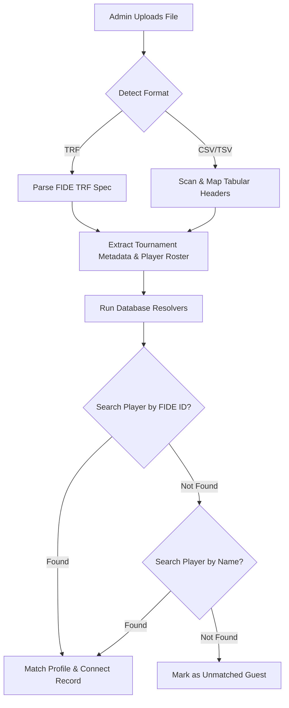

# ♟️ Universal Tournament Importer — Technical Architecture & Guide

Welcome to the official developer and administrator guide for the **Universal Tournament Importer** on the ChessFed Uganda platform. This module allows federation administrators to upload standard tournament records directly to Supabase, bypassing manual round entry while keeping our leaderboards completely live and ELO ratings synchronized!

---

## 📂 Supported Formats

### 1. FIDE TRF (Tournament Report File) — *Highly Recommended*
The official international exchange format for chess tournament data. Created automatically by **Swiss-Manager**, **arbiters**, and downloadable from **Chess-Results.com**.

* **Standard Structure:**
  - `012`: Tournament Name
  - `042`: Venue and City
  - `052`: Start Date (`YYYY/MM/DD`)
  - `062`: End Date (`YYYY/MM/DD`)
  - `082`: Player Rows (Standardized text columns containing Starting Rank, FIDE Title, Name, ELO Rating, Federation, FIDE ID, Points Scored, and Round-by-Round matches)

### 2. Excel CSV/TSV spreadsheets
A generic tab-separated (`.tsv`) or comma-separated (`.csv`) table export. 
* **Dynamic Header Recognition:** The parser automatically scans the first 5 rows to locate header columns. It dynamically matches headers like:
  - **Rank:** `rank`, `rk`, `no`, `sn`
  - **Name:** `name`, `player`
  - **Rating:** `rating`, `elo`, `rtg`
  - **FIDE ID:** `fideid`, `fideno`, `id`
  - **Points:** `pts`, `points`, `score`
  - **Rounds:** `r1`, `rd1`, `round1` etc.

---

## ⚙️ How Data Resolution Works

When a file is uploaded, the importer runs in **Dry-Run Validation mode**:

### 🧠 Database Seeding & GP Point Allocation
Once the admin verifies the dry-run comparison and clicks **"Execute Seeding Transaction"**, the following actions execute inside a **single atomic transaction**:
1. **Auto-Register Unmatched Players:** If selected, new profile accounts are registered in the `Player` table with default UCF member ratings.
2. **Create Tournament Record:** Creates the tournament listing.
3. **Map and Link Players:** Bridges the many-to-many relationship in Prisma between the tournament and participating players.
4. **Seed Scores:** Saves individual final scores to the `Score` model for accurate tournament standing displays.
5. **Grand Prix Point Allocation:** If flagged as a **Grand Prix event**, the top 5 Ugandan participants are automatically awarded Grand Prix Points:
   - **1st Place:** 10 Points
   - **2nd Place:** 8 Points
   - **3rd Place:** 6 Points
   - **4th Place:** 4 Points
   - **5th Place:** 2 Points

---

## 🛠️ Usage Instructions for Administrators

1. Navigate to `/login` and sign in using your Admin account.
2. Go to the Oversight Console (`/admin`) and click **"Import Tournament"** (or navigate directly to `/admin/import`).
3. Set your import configurations:
   - Check **"Grand Prix Event"** if this tournament should distribute national GP leaderboards points.
   - Check **"Auto-Register Players"** to automatically create member profiles for guest or new players.
4. Drag and drop your `.trf`, `.txt`, or `.csv` file into the upload zone.
5. Review the **Dry-Run Report Dashboard**:
   - Verify the parsed name, round counts, and dates.
   - Toggle the **Matched** tab to see which players correspond to existing database profiles.
   - Toggle the **Unmatched** tab to preview which players will be newly registered.
6. Click **"Execute Seeding Transaction"**.
7. Upon successful import, you will be redirected to the newly created tournament page featuring the imported standings!
